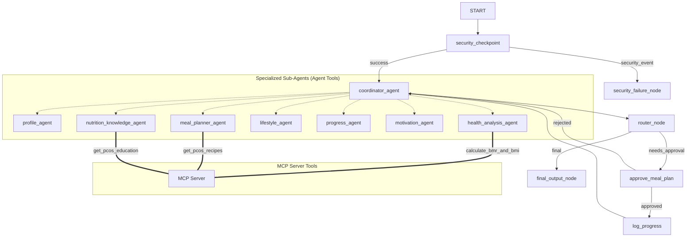

# NutriMind AI — PCOS Companion
## Submission Write-Up

### Problem Statement
Polycystic Ovary Syndrome (PCOS) affects millions of girls worldwide, leading to irregular cycles, insulin resistance, weight management issues, and fatigue. Managing this condition requires consistent lifestyle adjustments (nutrition, strength training, stress relief) and active symptom tracking. However, existing apps are either rigid trackers or generic calculators, lacking a secure, empathetic interface that guides users based on active symptoms and offers custom meal planning with simple home ingredients.

NutriMind AI solves this by building a multi-agent system where a supportive Coordinator routes queries to expert agents. It offers science-backed calculations, custom PCOS recipes, activity planning, and emotional support, while protecting sensitive health data.

---

### Solution Architecture
Below is the system graph representing the interaction between nodes, agents, and local MCP toolsets.

---

### Concepts Used & File References

- **ADK Workflow (Graph)**: Implemented in [app/agent.py](file:///c:/Users/DELL/Pictures/pooja/adk-workspace/nutrimind-ai/app/agent.py#L328-L343) using ADK 2.0 `Workflow` API, mapping `START`, `security_checkpoint`, `coordinator_agent`, `router_node`, `approve_meal_plan`, and `log_progress`.
- **LlmAgent**: Used for the orchestrator and all 7 sub-agents defined in [app/agent.py](file:///c:/Users/DELL/Pictures/pooja/adk-workspace/nutrimind-ai/app/agent.py#L42-L177).
- **AgentTool**: Wraps sub-agents and exposes them as tools to the coordinator in [app/agent.py](file:///c:/Users/DELL/Pictures/pooja/adk-workspace/nutrimind-ai/app/agent.py#L182-L194).
- **MCP Server**: Employs Python MCP SDK stdio server inside [app/mcp_server.py](file:///c:/Users/DELL/Pictures/pooja/adk-workspace/nutrimind-ai/app/mcp_server.py).
- **Security Checkpoint**: Implemented as the first node in [app/agent.py](file:///c:/Users/DELL/Pictures/pooja/adk-workspace/nutrimind-ai/app/agent.py#L316-L372).
- **Agents CLI**: Scaffolded, dependencies maintained, and run commands configured through `pyproject.toml` and `Makefile`.

---

### Security Design
Because health, symptom, and diagnosis logs constitute sensitive information, NutriMind AI enforces multiple layers of security at the entry node:

1. **PII Scrubbing**: Regexes scrub email addresses and phone numbers immediately at the entryway, ensuring contact info is never logged or exposed to third-party APIs.
2. **Prompt Injection Guard**: Detects critical keywords (e.g. `ignore previous instructions`, `system prompt`) and immediately routes the flow to a block node.
3. **Structured Audit Logging**: Outputs JSON audit details containing severity classifications (`INFO` / `WARNING` / `CRITICAL`) for every security check.
4. **Prescription Drug Monitoring**: Warns and logs if users attempt to seek prescription medication advice, serving as a vital safety filter for medical liability.

---

### MCP Server Design
The local Model Context Protocol (MCP) server runs securely inside the workspace environment to execute computation and database lookups:

- `calculate_bmr_and_bmi`: Mifflin-St Jeor formula tailored to female PCOS macro splits (30% protein, 35% fat, 35% low-GI carbs).
- `get_pcos_recipes`: Queries a local database for anti-inflammatory recipes matching ingredients available at home.
- `get_pcos_education`: Resolves queries on insulin resistance, exercise science, and hormone balancing using scientific knowledge.

---

### Human-in-the-Loop (HITL) Flow
A major feature of NutriMind AI is the meal plan review flow. Nutrition is highly subjective; therefore:
1. The `meal_planner_agent` generates a proposed diet.
2. The workflow pauses at the `approve_meal_plan` node using `RequestInput`.
3. The user gets to review the proposed meal and options, and replies with approval or modifications.
4. If approved, `log_progress` commits it to history. If rejected, it routes back to the planner with feedback.

---

### Demo Walkthrough
- **Scenario 1 (Registration)**: User submits profile (Anna, age 24, weight 68kg, height 162cm). The profile is saved, BMR/BMI calculations are triggered, and macros are set. A meal plan is proposed and triggers HITL review.
- **Scenario 2 (HITL Approval)**: User reviews the proposed PCOS Salmon plate and enters "yes". The plan is committed to the progress history list.
- **Scenario 3 (Safety Block)**: User attempts prompt injection. Security intercepts the attack, prints a `CRITICAL` log, and halts execution with a blocked warning.

---

### Impact & Value Statement
NutriMind AI bridges the gap between scientific coaching and psychological care. By giving girls a safe space to log symptom logs, receive customized hormone-balancing recipes, and seek comfort during low energy days, it empowers them to manage PCOS in a structured, healthy, and highly secure manner.
